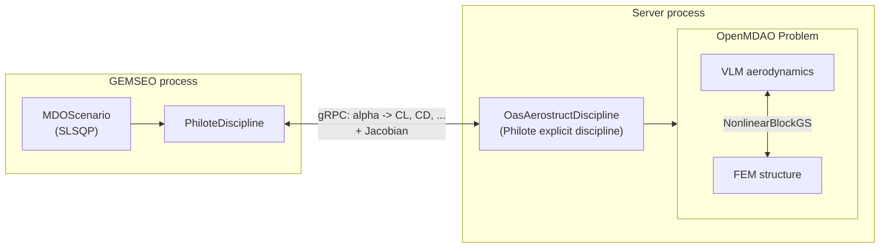

# Coupling OpenAeroStruct and GEMSEO through Philote-MDO

This tutorial builds on [Using GEMSEO with Philote-MDO](./gemseo.md) and
walks through
[`examples/openaerostruct_to_gemseo.py`](https://github.com/MDO-Standards/Philote-Python/blob/main/examples/openaerostruct_to_gemseo.py),
a more realistic case: instead of a toy analytic function, the remote
discipline is an [OpenAeroStruct](https://github.com/mdolab/OpenAeroStruct)
aerostructural analysis -- a coupled VLM aerodynamic model and a
finite-element structural model, solved together with an OpenMDAO
nonlinear solver -- and it is optimized with a gradient-based algorithm.

This example additionally requires OpenMDAO, OpenAeroStruct and the
[`philote-examples`](https://pypi.org/project/philote-examples/) package
(`pip install openaerostruct philote-examples`), which provides the
`OasAerostructDiscipline` used below.

## Why this matters: hiding an OpenMDAO MDA behind a Philote-MDO discipline

OpenAeroStruct is written for [OpenMDAO](https://openmdao.org): the
`philote-examples` package provides `OasAerostructDiscipline`, which
builds an OpenMDAO `Group` combining `AerostructGeometry` and
`AerostructPoint` for a wing, resolves the aero-structural coupling
internally with `NonlinearBlockGS`, and wraps the whole `om.Problem` as a
**single Philote-MDO explicit discipline**.

This is the key interoperability point: from the Philote-MDO (and
therefore GEMSEO) side, this coupled, iterative OpenMDAO analysis is
completely invisible. `PhiloteDiscipline` only ever sees a stateless
function `inputs -> outputs` plus a Jacobian -- exactly like the
`Paraboloid` discipline of the [previous tutorial](./gemseo.md). GEMSEO
does not need OpenMDAO, OpenAeroStruct, or any of their dependencies
installed: it only talks gRPC to a server that happens to run them.



## A gradient-based scenario is limited to what the server differentiates

`OasAerostructDiscipline` only declares two partial derivatives on the
server side (in its `_build_discipline` method):

```python
self.declare_subproblem_partial("CD", "alpha")
self.declare_subproblem_partial("CL", "alpha")
```

Only declared partials are computed and sent to the client: a
gradient-based GEMSEO scenario can therefore only use `alpha` as a design
variable, and `CL`/`CD` as objective/constraint candidates -- using any
other input as a design variable, or any other output as an objective or
constraint, would make GEMSEO request a Jacobian entry the server never
computes.

This shapes the scenario: **trim the wing** by finding the angle of
attack `alpha` that **minimizes drag** `CD` while holding the **lift
coefficient** `CL` at a target value, a classic aerostructural design
problem.

## Walkthrough

### Fixing the non-design inputs

The Philote-MDO protocol only transfers variable names, shapes and units
over gRPC -- not GEMSEO's default values. Since `alpha` is the only
design variable, every other input of the discipline (flight conditions
and mission parameters) must be given a value explicitly, or GEMSEO would
have no default to execute the discipline with. This is done once, by
updating the connected discipline's `default_input_data`:

```python
FIXED_INPUTS = {
    "v": array([248.136]),
    "Mach_number": array([0.84]),
    "re": array([1e6]),
    "rho": array([0.38]),
    "CT": array([grav_constant * 17.0e-6]),
    "R": array([11.165e6]),
    "W0": array([0.4 * 3e5]),
    "speed_of_sound": array([295.4]),
    "load_factor": array([1.0]),
    "empty_cg": np.zeros(3),
}


def create_discipline(server: grpc.Server) -> PhiloteDiscipline:
    discipline = pmdo.ExplicitServer(discipline=OasAerostructDiscipline())
    discipline.attach_to_server(server)
    oas_discipline = PhiloteDiscipline(channel=grpc.insecure_channel(f"{HOST}:{PORT}"))
    oas_discipline.default_input_data.update(FIXED_INPUTS)
    return oas_discipline
```

:::note
This is not specific to GEMSEO: any Philote-MDO client that does not set
a value for a non-design input runs into the same issue. The
[Sellar example](https://github.com/MDO-Standards/Philote-Python/blob/main/examples/sellar_gemseo_to_openmdao.py),
which drives remote *GEMSEO* disciplines from *OpenMDAO*, sets its fixed
parameters explicitly with `prob.set_val(...)` for the exact same reason.
:::

### Serving the discipline

As in the previous tutorial, serving the discipline only requires
starting a gRPC server and attaching an `ExplicitServer` wrapping it:

```python
def create_server() -> grpc.Server:
    server = grpc.server(futures.ThreadPoolExecutor(max_workers=1))
    server.add_insecure_port(f"[::]:{PORT}")
    server.start()
    return server
```

### Building and running the scenario

The design space has a single variable, `alpha` (in degrees); the
scenario minimizes `CD` under the equality constraint `CL = 0.5`, using
the gradient-based `SLSQP` algorithm -- made possible because the server
provides the `CL`/`CD` derivatives with respect to `alpha` analytically:

```python
if __name__ == "__main__":
    server = create_server()

    try:
        oas_disc = create_discipline(server)

        design_space = create_design_space()
        # alpha is in degrees, as declared by OasAerostructDiscipline.
        design_space.add_variable(
            "alpha", lower_bound=-10.0, upper_bound=15.0, value=5.0
        )

        scenario = create_scenario(
            [oas_disc],
            objective_name="CD",
            design_space=design_space,
            formulation_settings_model=DisciplinaryOpt_Settings(),
        )
        # Trim the wing: CL = 0.5
        scenario.add_constraint("CL", constraint_type="eq", value=0.5)
        scenario.execute(algo_settings_model=SLSQP_Settings(max_iter=20))

        out = oas_disc.local_data
        print(
            "Trimmed solution:",
            {name: out[name] for name in ("alpha", "CL", "CD", "failure")},
        )
        execute_post(scenario, OptHistoryView_Settings(save=True, show=False))

    finally:
        # Stop the server explicitly:
        # its worker threads would otherwise keep the process alive.
        server.stop(0)
```

Running the script converges in a handful of iterations and prints:

```text
Trimmed solution: {
    'alpha': array([4.07490213]),
    'CL': array([0.5]),
    'CD': array([0.03553854]),
    'failure': array([-0.91249284]),
}
```

`CL` reaches the target `0.5` exactly (the equality constraint fully
determines `alpha` here, since there is a single design variable), and
`failure` stays negative, meaning the structure remains within its
allowable stress margin at the trimmed condition.

## The full script

See the actual, always up-to-date source at
[`examples/openaerostruct_to_gemseo.py`](https://github.com/MDO-Standards/Philote-Python/blob/main/examples/openaerostruct_to_gemseo.py)
in the repository.

## Where to go next

[`examples/sellar_gemseo_to_openmdao.py`](https://github.com/MDO-Standards/Philote-Python/blob/main/examples/sellar_gemseo_to_openmdao.py)
shows the mirror image of this tutorial: instead of GEMSEO calling an
OpenMDAO/OpenAeroStruct discipline, GEMSEO's own Sellar disciplines are
served over gRPC with `GEMSEOtoPhiloteDiscipline` and optimized from an
OpenMDAO model with SLSQP -- the same coupling pattern used here (an
internal Gauss-Seidel solver resolving an algebraic loop behind the
scenes), but with the two frameworks swapped.
