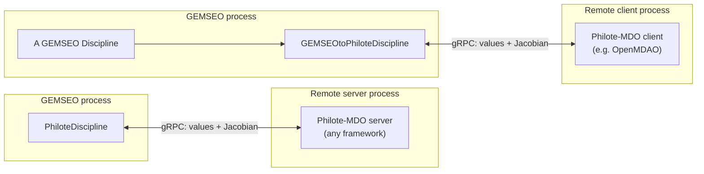

# Using GEMSEO with Philote-MDO

## What problem does this solve?

[Philote-MDO](https://github.com/MDO-Standards/Philote-Python) is a gRPC
protocol for exchanging MDO disciplines between tools. A discipline is
served by one process (possibly on another machine, in another language,
or built with another MDO framework) and called by a client process as if
it were local: the client sends input values, and the server streams back
the output values and, if available, the Jacobian.

`philote_mdo.gemseo` implements this protocol on the GEMSEO side, in
**both** directions:

- `PhiloteDiscipline` is a GEMSEO `Discipline` that connects to *any*
  Philote-MDO server (be it a `philote-mdo` discipline, an OpenAeroStruct
  model, or an OpenMDAO component served through
  `philote_mdo.openmdao.RemoteExplicitComponent`) and exposes it as a
  normal discipline, usable in an `MDOScenario` or an `MDA` like any
  other.
- `GEMSEOtoPhiloteDiscipline` does the opposite: it wraps a GEMSEO
  `Discipline` so that it can be served over gRPC and called from any
  Philote-MDO client, in particular an OpenMDAO model.



Both directions carry the discipline's Jacobian, not just its output
values, so a remote discipline can be used in a gradient-based
optimization exactly like a local one.

This page walks through the first, and simplest, direction --
`PhiloteDiscipline` consuming a remote discipline -- using the complete
example [`examples/paraboloid_gemseo.py`](https://github.com/MDO-Standards/Philote-Python/blob/main/examples/paraboloid_gemseo.py).
The [next tutorial](./gemseo-openaerostruct.md) covers a realistic,
coupled OpenMDAO analysis and the opposite direction is demonstrated in
[`examples/sellar_gemseo_to_openmdao.py`](https://github.com/MDO-Standards/Philote-Python/blob/main/examples/sellar_gemseo_to_openmdao.py).

## Installation

```bash
pip install philote-mdo gemseo
```

`philote_mdo.gemseo` (which provides `PhiloteDiscipline` and
`GEMSEOtoPhiloteDiscipline`) is part of `philote-mdo` itself; GEMSEO is
not a hard dependency of the package, so it must be installed separately
(or via the `philote-mdo[gemseo]` extra).

## Walkthrough: optimizing a remote Paraboloid discipline

The example serves `philote_mdo.examples.Paraboloid`, a toy discipline
computing `f_xy(x, y)`, over gRPC, and uses it as the objective of a
GEMSEO optimization scenario that also has a constraint computed locally.
The full script is reproduced at the end of this page; the sections below
explain it piece by piece.

### Serving the discipline

Any Philote-MDO discipline (here, the built-in `Paraboloid` example) is
served by wrapping it in a `philote_mdo.general.ExplicitServer` and
attaching that server to a started gRPC server:

```python
def create_server() -> grpc.Server:
    server = grpc.server(futures.ThreadPoolExecutor(max_workers=10))
    server.add_insecure_port(f"[::]:{PORT}")
    server.start()
    return server
```

### Connecting a GEMSEO client to it

`PhiloteDiscipline` is the GEMSEO-side client. Connecting it to the
channel above is enough: at construction, it queries the server for the
discipline's inputs, outputs and available partial derivatives, and
builds its GEMSEO grammars from that metadata -- no manual declaration is
needed.

```python
def create_discipline(server: grpc.Server) -> PhiloteDiscipline:
    discipline = ExplicitServer(discipline=Paraboloid())
    discipline.attach_to_server(server)
    return PhiloteDiscipline(channel=grpc.insecure_channel(f"{HOST}:{PORT}"))
```

From this point on, `paraboloid_disc` behaves like any other GEMSEO
`Discipline`: `paraboloid_disc.execute(...)` calls the remote
`ComputeFunction` RPC, and `paraboloid_disc.linearize(...)` calls the
remote `ComputeGradient` RPC.

### Adding a local constraint

Not every discipline of a scenario has to be remote. Here, the
constraint `g = x + y` is computed locally through GEMSEO's
`AutoPyDiscipline`, which turns a plain Python function into a
discipline by inspecting its signature and its `return` statement:

```python
def compute_constraint(x: ndarray, y: ndarray) -> ndarray:
    # AutoPyDiscipline infers the output name from this assignment, so the
    # variable must be named "g" and returned as-is (not e.g. "return x + y").
    g = x + y
    return g
```

:::warning
`AutoPyDiscipline` infers the output name(s) by parsing the literal
`return` statement of the function, so it must be `return g` with `g`
assigned beforehand, not an inlined expression like `return x + y`.
:::

### Running the scenario

The remote discipline and the local constraint discipline are combined in
a standard `MDOScenario`, built with `create_scenario`:

```python
server = create_server()

try:
    paraboloid_disc = create_discipline(server)
    design_space = create_design_space()
    design_space.add_variable("x", lower_bound=-50, upper_bound=50, value=3.0)
    design_space.add_variable("y", lower_bound=-50, upper_bound=50, value=-4.0)

    scenario = create_scenario(
        [paraboloid_disc, AutoPyDiscipline(py_func=compute_constraint)],
        objective_name="f_xy",
        design_space=design_space,
        formulation_settings_model=DisciplinaryOpt_Settings(),
    )

    # 0 <= g <= 10
    scenario.add_constraint("g", constraint_type="ineq", positive=True)
    scenario.add_constraint("g", constraint_type="ineq", value=10.0)
    scenario.execute(algo_settings_model=COBYQA_Settings(max_iter=100))

    print("Optimal design found:", design_space.get_current_value(as_dict=True))
finally:
    # Stop the server explicitly:
    # its worker threads would otherwise keep the process alive.
    server.stop(0)
```

Running the script prints the optimal design found by COBYQA:

```text
Optimal design found: {'x': array([7.]), 'y': array([-7.])}
```

which matches `f_xy(7, -7) = -27`, the known minimum of the paraboloid
under `0 <= x + y <= 10` (here reached at the boundary `g = 0`).

## The full script

```python title="examples/paraboloid_gemseo.py"
from __future__ import annotations

from concurrent import futures

import grpc
from gemseo import create_design_space
from gemseo import create_scenario
from gemseo.disciplines.auto_py import AutoPyDiscipline
from gemseo.settings.formulations import DisciplinaryOpt_Settings
from gemseo.settings.opt import COBYQA_Settings
from numpy import ndarray

from philote_mdo.examples import Paraboloid
from philote_mdo.gemseo import PhiloteDiscipline
from philote_mdo.general import ExplicitServer

HOST = "localhost"
PORT = 50051


def create_discipline(server: grpc.Server) -> PhiloteDiscipline:
    discipline = ExplicitServer(discipline=Paraboloid())
    discipline.attach_to_server(server)
    return PhiloteDiscipline(channel=grpc.insecure_channel(f"{HOST}:{PORT}"))


def create_server() -> grpc.Server:
    server = grpc.server(futures.ThreadPoolExecutor(max_workers=10))
    server.add_insecure_port(f"[::]:{PORT}")
    server.start()
    return server


def compute_constraint(x: ndarray, y: ndarray) -> ndarray:
    # AutoPyDiscipline infers the output name from this assignment, so the
    # variable must be named "g" and returned as-is (not e.g. "return x + y").
    g = x + y
    return g


if __name__ == "__main__":
    server = create_server()

    try:
        paraboloid_disc = create_discipline(server)
        design_space = create_design_space()
        design_space.add_variable("x", lower_bound=-50, upper_bound=50, value=3.0)
        design_space.add_variable("y", lower_bound=-50, upper_bound=50, value=-4.0)

        scenario = create_scenario(
            [paraboloid_disc, AutoPyDiscipline(py_func=compute_constraint)],
            objective_name="f_xy",
            design_space=design_space,
            formulation_settings_model=DisciplinaryOpt_Settings(),
        )

        # 0 <= g <= 10
        scenario.add_constraint("g", constraint_type="ineq", positive=True)
        scenario.add_constraint("g", constraint_type="ineq", value=10.0)
        scenario.execute(algo_settings_model=COBYQA_Settings(max_iter=100))

        print("Optimal design found:", design_space.get_current_value(as_dict=True))
    finally:
        # Stop the server explicitly:
        # its worker threads would otherwise keep the process alive.
        server.stop(0)
```

See the actual, always up-to-date source at
[`examples/paraboloid_gemseo.py`](https://github.com/MDO-Standards/Philote-Python/blob/main/examples/paraboloid_gemseo.py)
in the repository.

## Where to go next

- [Coupling OpenAeroStruct and GEMSEO](./gemseo-openaerostruct.md) applies
  the same `PhiloteDiscipline` pattern to a realistic, internally-coupled
  OpenMDAO analysis, and shows how the discipline's non-design inputs
  must be set explicitly since Philote-MDO does not transfer GEMSEO's
  default values.
- [`examples/sellar_gemseo_to_openmdao.py`](https://github.com/MDO-Standards/Philote-Python/blob/main/examples/sellar_gemseo_to_openmdao.py)
  demonstrates the opposite direction with `GEMSEOtoPhiloteDiscipline`:
  GEMSEO's Sellar disciplines are served over gRPC and optimized from an
  OpenMDAO model.
